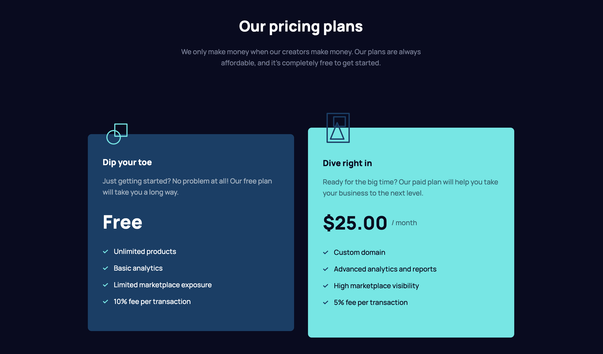

# Maker pre-launch landing page

## Table of contents

- [Overview](#overview)
  - [Screenshot](#screenshot)
  - [Links](#links)
- [My process](#my-process)
  - [Built with](#built-with)
- [Author](#author)

## Overview

### Screenshot

### Links

- Solution URL: [Solution URL](https://github.com/kisu-seo/maker_pre-launch_landing_page)
- Live Site URL: [Live URL](https://kisu-seo.github.io/maker_pre-launch_landing_page/)

## My process

### Built with

- **Semantic HTML5 Markup** — Structured with purpose-built tags (`<header>`, `<main>`, `<section>`, `<article>`, `<footer>`, `<form>`) to create a meaningful document outline that supports both SEO and screen reader navigation.

- **Web Accessibility (A11y)**
  - A custom `.sr-only` CSS class (handwritten, since Tailwind CDN does not support `@apply`) visually hides the email field's `<label>` while keeping it fully readable by assistive technologies.
  - `aria-hidden="true"` applied to all purely decorative images (squiggle SVGs, hero illustrations) to prevent redundant announcements by screen readers.
  - `aria-invalid` attribute dynamically toggled by JavaScript (`"false"` → `"true"`) on the email input to communicate validation state to assistive technologies.
  - `aria-live="polite"` on the error message `` so screen readers automatically announce errors when they appear, without interrupting the user.

- **Tailwind CSS (CDN + Custom Design Token System)**
  - All brand values are centralized inside `tailwind.config` (injected via a `<script>` tag), defining a complete set of **custom color tokens** (`neutral900`, `cyan400`, `red400`, `blue800`, etc.), **typography presets** (`preset1`–`preset7` with size, line-height, and font-weight), **spacing tokens** (100-scale: `200`=16px, `400`=32px, `600`=48px…), and **border-radius tokens**.
  - **Mobile-First Responsive Design**: Base styles target mobile; `md:` (768px+) and `lg:` (1024px+) breakpoints progressively enhance the layout — from stacked single-column to a 4-column grid (`lg:grid-cols-4`) for features, and side-by-side pricing cards (`lg:flex-row`).
  - **Scoped Interaction States**: `hover:` and `focus:` effects are deliberately prefixed with `lg:hover:` and `lg:focus:` so they only activate on pointer devices (desktop), avoiding accidental triggering on touch screens.
  - **Focus Ring Trick**: `lg:focus:ring-offset-neutral900` paints the ring gap in the same dark navy as the page background, creating a visually transparent "halo" effect around focused elements — a technique that requires synchronizing the offset color with the surrounding background.
  - **Layout Shift Prevention Trick**: The email error `` uses `absolute top-full left-0` to float it outside the document flow, so its appearance/disappearance never pushes other elements (buttons, footer background) out of position.
  - **Stacking Context Control**: `z-[-1]` on hero illustrations places them behind text content, while `relative z-10` on `<main>` and `<footer>` ensures they stack correctly above each other without overlap artifacts.

- **Vanilla JavaScript (ES6+ / Modular Pattern)**
  - **Helper Function Separation**: UI side-effects are fully extracted into `showError(message)` and `clearError()` helper functions, keeping the `submit` event listener responsible only for validation logic — a clean implementation of the *Separation of Concerns* principle.
  - **Early Return Pattern**: Validation checks use `return` after each failure to exit immediately, eliminating deeply nested `if-else` blocks and making the control flow (`validate → show error OR success`) readable at a glance.
  - **`EMAIL_REGEX` Constant**: The validation regular expression is extracted as a named constant (`/^[^\s@]+@[^\s@]+\.[^\s@]+$/`) rather than an inline literal, improving readability and making future rule updates straightforward.
  - **Targeted Class Toggle (Border Bug Fix)**: On error, only `max-lg:border-red400` is added — `border-transparent` is intentionally *never removed*. This prevents a white border from bleeding through on desktop, where Tailwind's `max-lg:` condition does not apply.
  - **JSDoc Documentation**: All functions are annotated with `@param`, `@returns`, and inline comments explaining the *"why"* behind non-obvious patterns (e.g., why `border-transparent` must not be removed), plus a `// TODO` marker for future backend API integration.

## Author

- Website - [Kisu Seo](https://github.com/kisu-seo)
- Frontend Mentor - [@kisu-seo](https://www.frontendmentor.io/profile/kisu-seo)
